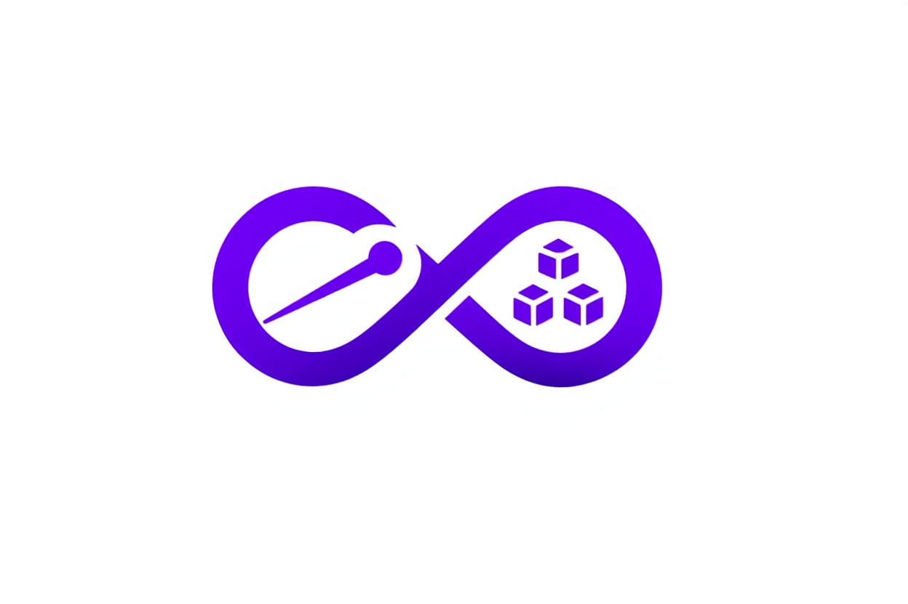

# Orchestr8

<p align="center">
  
</p>

<h1 align="center">
  Orchestr8
  <br>
  <small style="font-size: 0.4em; font-weight: 300; color: #6b7280;">
    One Manifest. Every Environment. Effortlessly.
  </small>
</h1>

<p align="center">
  <strong>The Unified Deployment Orchestrator for Modern Infrastructure Stacks</strong>
</p>

<p align="center">
  <a href="https://github.com/orchestr8/orchestr8/releases">
    
  </a>
  <a href="https://golang.org">
    
  </a>
  <a href="LICENSE">
    
  </a>
  <a href="https://github.com/orchestr8/orchestr8/actions">
    
  </a>
</p>

<p align="center">
  <a href="#-features">Features</a> •
  <a href="#-quick-start">Quick Start</a> •
  <a href="#-manifest-showcase">Manifest</a> •
  <a href="#-architecture">Architecture</a> •
  <a href="#-providers">Providers</a> •
  <a href="#-contribute">Contribute</a>
</p>

---

## ✨ Why Orchestr8?

| Problem | Solution |
|------|------|
| Tool sprawl & manual workflows | One declarative manifest |
| Environment drift | Deterministic execution |
| No dependency awareness | Automatic DAG resolution |
| Fragmented tooling | Unified orchestration |

---

## 🚀 Quick Start

### Installation

```bash
# macOS / Linux
brew install orchestr8/tap/orchestr8

# Windows
winget install Orchestr8.Orchestr8

# Docker
docker run --rm -v ${PWD}:/app ghcr.io/orchestr8/orchestr8:latest
````

### First Deployment

```yaml
name: my-app

components:
  - name: database
    type: terraform
    source: ./infra/db.tf

  - name: api
    type: kubernetes
    source: ./k8s/api.yaml
    depends_on: [database]
```

```bash
orchestr8 plan
orchestr8 deploy
orchestr8 status
orchestr8 destroy
```

---

## 📋 Manifest Showcase

<details>
<summary><strong>Full Example</strong></summary>

```yaml
project:
  name: ecommerce-platform
  version: "2.3.0"

environments:
  production:
    target: aws-eks
    region: us-east-1

components:
  - name: vpc
    type: terraform
    source: ./infra/network.tf

  - name: backend
    type: kubernetes
    depends_on: [vpc]
    source: ./services/api.yaml

  - name: frontend
    type: kubernetes
    depends_on: [backend]
    source: ./frontend/deployment.yaml
```

</details>

---

## 🏗 Architecture

| Component       | Responsibility         |
| --------------- | ---------------------- |
| Manifest Engine | Parsing & validation   |
| DAG Resolver    | Dependency ordering    |
| Provider System | Tool integrations      |
| State Manager   | Drift & reconciliation |

---

## 🔌 Supported Providers

* Terraform
* Kubernetes
* Helm
* Docker
* AWS / Azure / GCP
* Ansible
* Pulumi
* Custom Providers

---

## 📊 Feature Comparison

| Feature                  | Orchestr8 | Terraform | Helm |
| ------------------------ | --------- | --------- | ---- |
| Multi-tool orchestration | ✅         | ❌         | ❌    |
| Dependency graph         | ✅         | ⚠️        | ⚠️   |
| Multi-environment        | ✅         | ⚠️        | ⚠️   |
| Unified state            | ✅         | ❌         | ❌    |

---

## 🛠 Development

```bash
git clone https://github.com/orchestr8/orchestr8.git
cd orchestr8

make deps
make test
make build
```

### Project Structure

```
cmd/        CLI entrypoint
internal/   Core engine
pkg/        Public packages
examples/   Sample manifests
docs/       Documentation
```

---

## 🗺 Roadmap

* v0.3 — Multi-cloud, policies
* v0.4 — GitOps & drift detection
* v0.5 — Cost & observability
* v1.0 — Enterprise ready

---

## 🤝 Contributing

Contributions are welcome!

* Fork the repo
* Create a feature branch
* Add tests
* Submit a PR

See `CONTRIBUTING.md` for details.

---

## 📄 License

Apache 2.0 — see [LICENSE](LICENSE)

---

<p align="center">
  <strong>Star ⭐ the repo if Orchestr8  simplifies your infrastructure</strong>
</p>